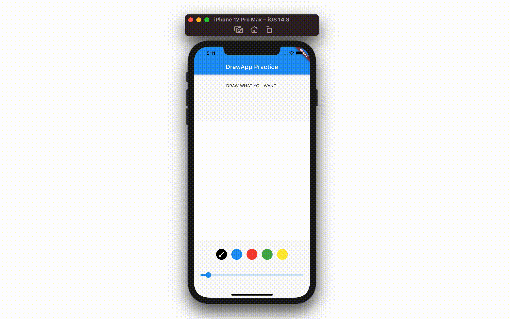

# draw_your_image

draw_your_image is a Flutter package for drawing picture with fingers.

# Demo



# Usage

## Basic

The very first step for draw_your_image is to place `Draw` widget at anywhere you want in the widget tree.

```dart
@override
Widget build(BuildContext context) {
    return Draw(
        backgroundColor: Colors.blue.shade50,
        strokeColor: Colors.red,
        strokeWidth: 8,
    );
}
```

`Crop` widget would display a simple canvas which users can draw whatever they want with given `strokeColor` and `strokeWidth`.